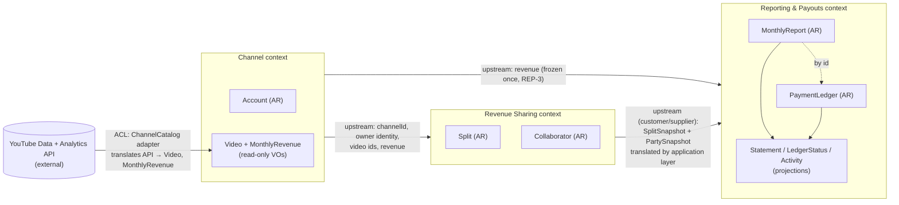
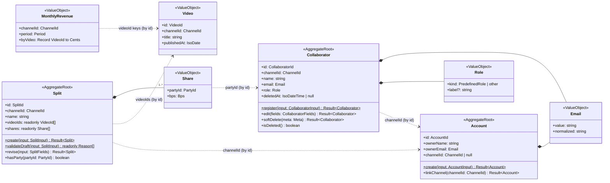
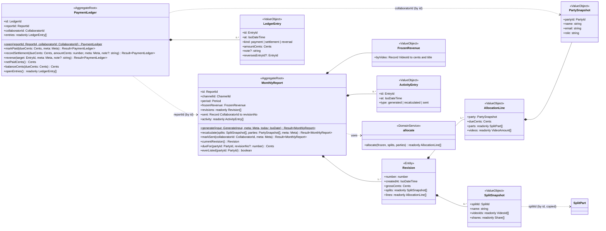
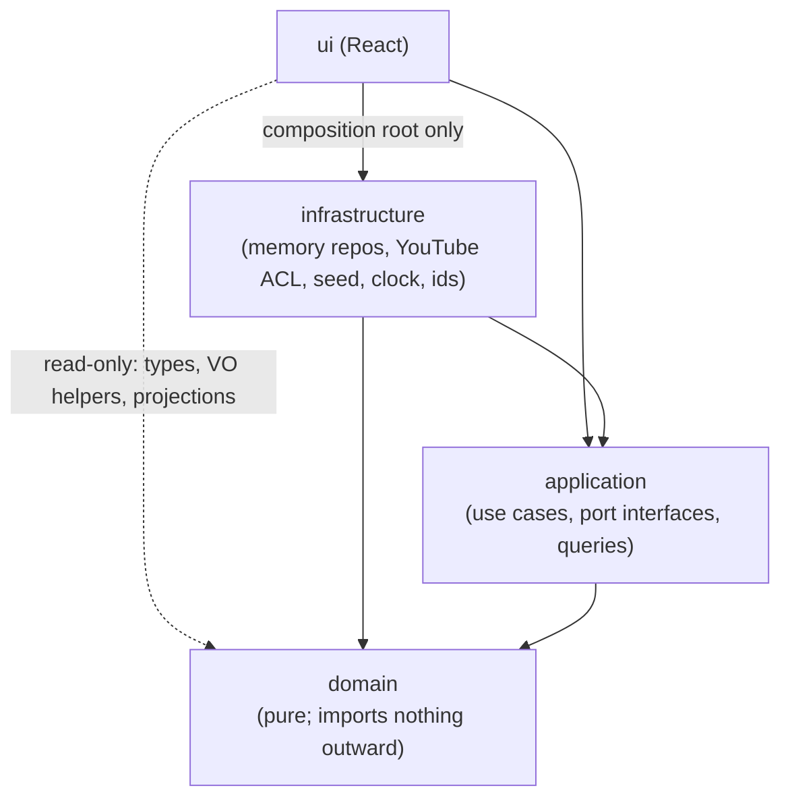

# Syncz — Domain Design (TypeScript)

Status: design for implementation · Date: 2026-10-07 · Source of truth for rules: [`invariants.md`](./invariants.md)

This doc is a build sheet for the domain layer. It keeps the structure loose and small: strict TypeScript, a few small immutable aggregates, pure functions for cross-aggregate rules, and no frameworks or FP libraries.

## 0. Conventions (read first)

### Core types (`domain/shared`)

```ts
// ids.ts: branded (nominal) ids. Zero runtime cost; constructed only by the id helpers below.
type Brand<T, B extends string> = T & { readonly __brand: B }
export type AccountId      = Brand<string, 'AccountId'>
export type ChannelId      = Brand<string, 'ChannelId'>
export type VideoId        = Brand<string, 'VideoId'>
export type SplitId        = Brand<string, 'SplitId'>
export type CollaboratorId = Brand<string, 'CollaboratorId'>
export type ReportId       = Brand<string, 'ReportId'>
export type LedgerId       = Brand<string, 'LedgerId'>       // `${ReportId}:${CollaboratorId}`
export type EntryId        = Brand<string, 'EntryId'>        // ledger + activity entries
export const OWNER_ID = 'owner' as Brand<'owner', 'OwnerId'>
export type OwnerId = typeof OWNER_ID
export type PartyId = OwnerId | CollaboratorId               // anyone who can hold a share
export const asSplitId = (s: string) => s as SplitId          // one cast helper per id; used by infra/app only
export const ledgerIdOf = (r: ReportId, c: CollaboratorId) => `${r}:${c}` as LedgerId

// numbers.ts: branded integer units
export type Cents = Brand<number, 'Cents'>   // integer USD cents; may be negative only in LedgerEntry
export type Bps   = Brand<number, 'Bps'>     // integer hundredths of a percent; 10000 = 100.00%
export const FULL = 10000 as Bps, MIN_SHARE = 10 as Bps
export type IsoDateTime = Brand<string, 'IsoDateTime'>
export type IsoDate     = Brand<string, 'IsoDate'>
export type Period      = Brand<string, 'Period'>      // "YYYY-MM", see period.ts

// result.ts
export type InvariantCode =
  | 'ACC-1' | 'ACC-2' | 'SPL-1' | 'SPL-2' | 'SPL-3' | 'SPL-4' | 'SPL-5' | 'SPL-6' | 'SPL-7' | 'SPL-8'
  | 'SPL-9' | 'SPL-10' | 'SPL-11' | 'COL-1' | 'COL-2' | 'COL-3' | 'COL-4' | 'COL-5' | 'COL-6' | 'COL-7'
  | 'REP-1' | 'REP-2' | 'REP-3' | 'REP-4' | 'REP-5' | 'REP-6' | 'REP-7' | 'REP-8' | 'REP-9' | 'REP-10' | 'REP-11'
  | 'PAY-1' | 'PAY-2' | 'PAY-3' | 'PAY-4' | 'PAY-5' | 'PAY-6' | 'PAY-7' | 'PAY-8' | 'PAY-9' | 'STM-3'
export type ReasonCode = InvariantCode | 'NOT_FOUND' | 'INVALID_INPUT'
export interface Reason { readonly code: ReasonCode; readonly message: string }
export type Result<T> =
  | { readonly ok: true;  readonly value: T }
  | { readonly ok: false; readonly reasons: readonly Reason[] }
export const ok = <T>(value: T): Result<T> => ({ ok: true, value })
export const fail = (code: ReasonCode, message: string): Result<never> => ({ ok: false, reasons: [{ code, message }] })
export const failAll = (reasons: readonly Reason[]): Result<never> => ({ ok: false, reasons })
// collect(...checks: Result<unknown>[]): readonly Reason[]  (gathers every reason)

// meta.ts: injected time + id, never generated inside the domain
export interface Meta { readonly id: EntryId; readonly at: IsoDateTime }
```

| Topic | Decision |
|---|---|
| **Result** | Every command, factory and policy returns `Result<T>`. It is a discriminated union on `ok`, so TS narrows `value`/`reasons`. `code` is an invariant ID or `NOT_FOUND`/`INVALID_INPUT`. Validation **collects all** reasons, because the UI shows all of them. Policies return `Result<void>`. |
| **Throwing** | Business-rule violations are never thrown. The domain throws only for programmer errors, i.e. a broken internal assertion. Strict types catch most of these at compile time. |
| **Aggregates** | **Small immutable classes** with a `private constructor`. Creation goes through `static create(...)`, which validates, and `static fromSnapshot(s)`, which rehydrates without validation. Commands return `Result<NewInstance>`, and the original is never mutated, so a rejection changes nothing. Fields are `readonly`. Instances are `Object.freeze`d. |
| **Value objects** | **`readonly` types + factory functions**, not classes: `type Share = Readonly<{ partyId: PartyId; bps: Bps }>`, created by `Share.create(input): Result<Share>` from a namespace module (`export const Share = { create }`). **Why:** VOs here are pure data. As plain readonly objects they are JSON-serializable with no mapping, compare structurally (`toEqual`), work directly as React props, and sit inside aggregate snapshots unchanged. Classes would add `toJSON`/rehydration code for no behavior gain. VOs with behavior (e.g. `Period`) expose functions in the same module. |
| **Time and ids** | Commands take `meta: Meta`. Rules about "now" take `today: IsoDate`. The domain never calls `Date.now`, `new Date()`, `Math.random` or `crypto`. |
| **Money / percent** | Use `Cents` and `Bps`, both branded integers. Floats and dollars never appear in the domain. Formatting happens only in the UI. |
| **Owner** | The owner is a *party* (`OWNER_ID`), not a `Collaborator`. `PartyId = OwnerId \| CollaboratorId`, so the compiler stops an owner being passed where a `CollaboratorId` is required (half of COL-7). |
| **Persistence** | Each aggregate has `toSnapshot(): XSnapshot` (a plain readonly JSON type) and `static fromSnapshot(s: XSnapshot)`. Repositories store snapshots. |
| **Reason messages** | Aggregates that only know ids (e.g. `Split` for SPL-3/SPL-8) name parties by id in `message`, and set the optional `partyId` on the `Reason`. The **application layer** rewrites these messages with display names (collaborator name, "You") before they reach the UI. The domain never gets a name-lookup dependency. *(Implement `Reason.partyId` + the presenter in Step 4.)* |
| **Domain events** | **None.** The report activity log is a *projection* that merges the report's own append-only `activity` with the append-only ledger entries. No cross-aggregate event plumbing is needed. |

---

## 1. Bounded contexts



| Context | Purpose | Relations |
|---|---|---|
| **Channel** | Who the owner is and which YouTube channel they linked. Exposes the video catalog and monthly revenue as read-only data. | **Upstream** of both. YouTube sits behind an **anti-corruption layer**: the `ChannelCatalog` interface (application) and its adapter (infrastructure) translate API payloads into `Video`/`MonthlyRevenue`. No YouTube type crosses into the domain. |
| **Revenue Sharing** | The agreements: who gets what percentage of which videos. | **Downstream** of Channel (video ids, owner email). **Upstream supplier** to Reporting. |
| **Reporting & Payouts** | Turns frozen revenue and the agreements in force into immutable monthly revisions, statements and an append-only payment ledger. | **Downstream customer** of Sharing. It never imports `Split`/`Collaborator` types. The application layer translates them into Reporting-owned `SplitSnapshot`/`PartySnapshot`, which is a lightweight ACL. Snapshots give SPL-10 and COL-6 by construction. |

Contexts are **folders**, not packages. A tiny **shared kernel** (`domain/shared`) holds ids, `Cents`/`Bps`, `Period`, `Result` and `Meta`. A lint/import check stops `reporting/` importing from `sharing/` (see §5).

---

## 2. Building blocks

### Aggregate roots

| Root | Context | Key fields | Responsibility |
|---|---|---|---|
| `Account` | Channel | `id: AccountId`, `ownerName: string`, `ownerEmail: Email`, `channelId: ChannelId \| null` | Owner identity + the single linked channel (ACC-1). |
| `Split` | Sharing | `id: SplitId`, `channelId: ChannelId`, `name: string`, `videoIds: readonly VideoId[]`, `shares: readonly Share[]` | A named group of videos with valid shares summing to 100% (SPL-1…6, 9, 11). |
| `Collaborator` | Sharing | `id: CollaboratorId`, `channelId`, `name: string`, `email: Email`, `role: Role`, `deletedAt: IsoDateTime \| null` | A payee's identity, role and soft-delete state (COL-1, 3, 5). |
| `MonthlyReport` | Reporting | `id: ReportId`, `channelId`, `period: Period`, `frozenRevenue: FrozenRevenue`, `revisions: readonly Revision[]`, `sent: Readonly<Record<CollaboratorId, number>>`, `activity: readonly ActivityEntry[]` | One month: frozen revenue, immutable revisions, sent markers, append-only activity (REP-2…11, STM-3). |
| `PaymentLedger` | Reporting | `id: LedgerId`, `reportId: ReportId`, `collaboratorId: CollaboratorId`, `entries: readonly LedgerEntry[]` | Append-only money entries for **one collaborator in one report** (PAY-1…4, 6, 7, 9). |

### Entities inside aggregates

| Entity | Inside | Type | Responsibility |
|---|---|---|---|
| `Revision` | `MonthlyReport` | `Readonly<{ number: number; createdAt: IsoDateTime; grossCents: Cents; splits: readonly SplitSnapshot[]; lines: readonly AllocationLine[] }>` | Revision `n`. Identified by `number`, created once, never mutated (REP-7). Because it is immutable, it is modelled as a readonly type like a VO. |

### Value objects (`readonly` types + factory modules)

| VO | Where | Type / factory | Responsibility |
|---|---|---|---|
| `Period` | shared | `Period` (branded string). `Period.parse(s): Result<Period>`, `isEndedBy(p, today: IsoDate): boolean`, `latestReportable(today): Period` | A calendar month (REP-2). |
| `Email` | shared | `{ value: string; normalized: string }`. `Email.create(raw): Result<Email>` | Trimmed and valid. `normalized` is lower-cased for uniqueness (COL-1/2). |
| `Role` | Sharing | `{ kind: PredefinedRole } \| { kind: 'other'; label: string }`. `Role.create(kind, label?)` | `ROLES` const tuple, or Other with a label (COL-3). |
| `Share` | Sharing | `{ partyId: PartyId; bps: Bps }`. `Share.create(partyId, bps: number)` | Integer bps (SPL-2). |
| `Video` | Channel | `{ id: VideoId; channelId: ChannelId; title: string; publishedAt: IsoDate }` | Read-only, produced by the ACL. |
| `MonthlyRevenue` | Channel | `{ channelId; period: Period; byVideo: Readonly<Record<VideoId, Cents>> }` | Read-only revenue (ACC-2). |
| `FrozenRevenue` | Reporting | `{ byVideo: Readonly<Record<VideoId, { cents: Cents; title: string }>> }`. `FrozenRevenue.freeze(revenue, videos): Result<FrozenRevenue>`, `grossOf(f): Cents` | Captured at Revision 1 (REP-3). |
| `SplitSnapshot` | Reporting | `{ splitId: SplitId; name: string; videoIds: readonly VideoId[]; shares: readonly { partyId: PartyId; bps: Bps }[] }` | The split as it was at revision time (SPL-9/10/11). |
| `PartySnapshot` | Reporting | `{ partyId: PartyId; name: string; email: string; role: string }` | The payee as they were (REP-8, COL-6). |
| `AllocationLine` | Reporting | `{ party: PartySnapshot; dueCents: Cents; parts: readonly SplitPart[]; videos: readonly VideoAmount[] }` | One party in a revision (REP-4/5/6). |
| `SplitPart` / `VideoAmount` | Reporting | `{ splitId: SplitId \| null; splitName: string; bps: Bps; cents: Cents }` / `{ videoId; title; revenueCents: Cents; bps: Bps; cents: Cents; splitId; splitName }` | Line breakdown. `splitId: null` means "Unsplit videos". |
| `ActivityEntry` | Reporting | `{ id: EntryId; at: IsoDateTime } & ({ type: 'generated'; revision: 1; grossCents } \| { type: 'recalculated'; revision; oldGrossCents; newGrossCents; changes: readonly DueChange[] } \| { type: 'sent'; revision; collaboratorId; name })` | Discriminated union (REP-9). |
| `LedgerEntry` | Reporting | `{ id: EntryId; at: IsoDateTime; note?: string } & ({ kind: 'payment'; amountCents: Cents } \| { kind: 'settlement'; amountCents: Cents } \| { kind: 'reversal'; amountCents: Cents; reversesEntryId: EntryId })` | Discriminated union (PAY-1/2/3/9). Only `reversal` carries `reversesEntryId`. |

### Domain services (pure functions, no I/O)

| Service | Context | Signature | Responsibility |
|---|---|---|---|
| `allocate` | Reporting | `(frozen: FrozenRevenue, splits: readonly SplitSnapshot[], parties: readonly PartySnapshot[]) => readonly AllocationLine[]` | Allocation math (REP-4/5/6). Unsplit videos go 100% to the owner. Called by `MonthlyReport`. |
| `checkVideoExclusivity` | Sharing | `(split: Split, others: readonly Split[]) => Result<void>` | SPL-7 |
| `checkSplitReferences` | Sharing | `(split: Split, ctx: { channelVideoIds: ReadonlySet<VideoId>; collaborators: readonly Collaborator[] }) => Result<void>` | SPL-8 |
| `checkEmailAvailable` | Sharing | `(email: Email, all: readonly Collaborator[], ownerEmail: Email, selfId?: CollaboratorId) => Result<void>` | COL-2 (`all` includes soft-deleted) |
| `checkCollaboratorRemovable` | Sharing | `(id: CollaboratorId, splits: readonly Split[]) => Result<void>` | COL-4 |
| `checkPayable` | Reporting | `(report: MonthlyReport \| null, partyId: PartyId) => Result<CollaboratorId>` | PAY-5 + COL-7. On success it returns the narrowed `CollaboratorId`. |
| Projections | Reporting | `buildStatement(report, c, revisionNo): Statement`, `needsResend(report, c): boolean`, `ledgerStatus(dueCents, ledger \| null): LedgerStatus`, `reportActivity(report, ledgers): readonly ActivityRow[]`, `reportTotals(report, ledgers): ReportTotals` | Read models (STM-1/2, balances, merged activity feed). |

### Ports (`application/ports.ts`, implemented in infrastructure)

```ts
export interface AccountRepository {
  get(): Promise<Account | null>
  save(account: Account): Promise<void>
}
export interface SplitRepository {
  findById(id: SplitId): Promise<Split | null>
  listByChannel(channelId: ChannelId): Promise<readonly Split[]>
  save(split: Split): Promise<void>
  delete(id: SplitId): Promise<void>                  // hard delete is fine (SPL-11)
}
export interface CollaboratorRepository {
  findById(id: CollaboratorId): Promise<Collaborator | null>
  listByChannel(channelId: ChannelId): Promise<readonly Collaborator[]>  // includes soft-deleted
  save(c: Collaborator): Promise<void>                // no delete (COL-5)
}
export interface MonthlyReportRepository {
  findById(id: ReportId): Promise<MonthlyReport | null>
  findByPeriod(channelId: ChannelId, period: Period): Promise<MonthlyReport | null>
  listByChannel(channelId: ChannelId): Promise<readonly MonthlyReport[]>
  add(report: MonthlyReport): Promise<void>           // rejects duplicate period (REP-1 backstop)
  save(report: MonthlyReport): Promise<void>          // no delete (REP-10)
}
export interface PaymentLedgerRepository {
  findById(id: LedgerId): Promise<PaymentLedger | null>
  listByReport(reportId: ReportId): Promise<readonly PaymentLedger[]>
  save(ledger: PaymentLedger): Promise<void>          // no delete (PAY-1)
}
export interface ChannelCatalog {                     // YouTube ACL; read-only (ACC-2)
  listVideos(channelId: ChannelId): Promise<readonly Video[]>
  monthlyRevenue(channelId: ChannelId, period: Period): Promise<MonthlyRevenue | null>
}
export interface Clock { now(): IsoDateTime; today(): IsoDate }
export interface IdGenerator { next(prefix: string): string }  // use cases brand it: as SplitId, etc.
export interface Ports {
  repos: { account: AccountRepository; splits: SplitRepository; collaborators: CollaboratorRepository
           reports: MonthlyReportRepository; ledgers: PaymentLedgerRepository }
  catalog: ChannelCatalog; clock: Clock; ids: IdGenerator
}
```

Ports are `async` even in memory, so a backend can be added later without changing use-case signatures. The domain stays synchronous.

---

## 3. Class diagrams

### Channel + Revenue Sharing



### Reporting & Payouts



```ts
interface GenerateInput {
  id: ReportId; channelId: ChannelId; period: Period
  revenue: MonthlyRevenue; videos: readonly Video[]       // only generate() accepts revenue (REP-3)
  splits: readonly SplitSnapshot[]; parties: readonly PartySnapshot[]
}
```

`recalculate` has **no revenue parameter**. REP-3 is enforced by the signature itself.

---

## 4. Invariant map

Legend: **AM** = aggregate method · **VO** = VO factory · **DS** = domain service (pure) · **AP** = application policy (use case) · **S** = structural (types/shape of the code, plus a test) · **T** = also guaranteed at compile time.

| ID | Enforced by | Notes |
|---|---|---|
| ACC-1 | AM `Account.linkChannel` + S | Rejects linking when a *different* channel is already linked. Every aggregate carries `channelId: ChannelId`; repositories filter by it; use cases read it from `Account`. |
| ACC-2 | S + VO `FrozenRevenue.freeze` | No domain command creates or edits revenue. `MonthlyRevenue` is read-only and comes only from `ChannelCatalog`. `FrozenRevenue` rejects non-integer or negative cents. |
| SPL-1 | AM `Split.create` / `revise` | Total must equal `FULL` on save. `Split.validateDraft` gives the same reasons for live UI hints; drafts are never persisted. |
| SPL-2 | VO `Share.create` + **T** | Input `number` must be a non-negative integer → `Bps`. A raw number cannot be assigned to `Bps` without the factory. |
| SPL-3 | AM `Split.create/revise` | Every non-owner share ≥ `MIN_SHARE`. |
| SPL-4 | AM `Split.create/revise` | Exactly one `OWNER_ID` share. Owner bps is 0 or ≥ `MIN_SHARE`. `revise` cannot drop the owner. |
| SPL-5 | AM `Split.create/revise` | Unique `partyId`s. |
| SPL-6 | AM `Split.create/revise` | Non-blank `name.trim()` and `videoIds.length ≥ 1`. |
| SPL-7 | DS `checkVideoExclusivity` ← AP `saveSplit` | The use case loads all channel splits except this one. |
| SPL-8 | DS `checkSplitReferences` ← AP `saveSplit` | Video ids come from `ChannelCatalog.listVideos`. Collaborators must exist and not be soft-deleted. Messages name parties by id; the application layer substitutes names (see §0 Reason messages). |
| SPL-9 | S + AM `MonthlyReport.generate/recalculate` | `Split` has no effective-date fields. A revision applies one `SplitSnapshot[]` to the whole period. |
| SPL-10 | S (snapshots) + AP | A revision stores copies (`SplitSnapshot`, `AllocationLine`), never references. `recalculateReport` is the only use case that writes a report after generation. `saveSplit`/`deleteSplit` never receive the report repository. |
| SPL-11 | AP `deleteSplit` (no guard) + S | Hard delete. SPL-7 checks against current splits, so videos are freed. Revisions keep `splitName`. |
| COL-1 | VO `Email.create` + AM `Collaborator.register/edit` | Non-blank name. The email regex is lifted from the prototype. |
| COL-2 | DS `checkEmailAvailable` ← AP `addCollaborator`/`editCollaborator` | Compares `Email.normalized`. Soft-deleted collaborators are included. The owner email comes from `Account`. |
| COL-3 | VO `Role.create` + **T** | `ROLES` is an `as const` tuple, so `PredefinedRole` is a literal union. `other` requires a non-blank label. |
| COL-4 | DS `checkCollaboratorRemovable` ← AP `deleteCollaborator` | The message lists the blocking split names. |
| COL-5 | AM `Collaborator.softDelete` + S | Sets `deletedAt`. A second delete is rejected, and so is `edit` on a deleted collaborator. The repository has no `delete`. |
| COL-6 | S (REP-8 snapshots) | An edit never reaches a revision: `PartySnapshot` is a copy. |
| COL-7 | **T** + AP + DS `checkPayable` | `OwnerId` is not assignable to `CollaboratorId`, so collaborator commands, `PaymentLedger.open` and `markSent` cannot receive the owner at compile time. At the UI/app boundary (untyped route params) `checkPayable` and collaborator use cases still reject `OWNER_ID` with COL-7. |
| REP-1 | AP `generateReport` (`findByPeriod` must be null) + repo `add` backstop | |
| REP-2 | VO `Period.parse` + AM `MonthlyReport.generate(…, today)` | Valid `YYYY-MM` and `isEndedBy(period, today)`. "No revenue data" (catalog returned null) is rejected by AP `generateReport` with REP-2. |
| REP-3 | AM `generate` + **T** | `FrozenRevenue` is built only in `generate`. `recalculate`'s signature has no revenue argument. |
| REP-4 | DS `allocate` + AM assertion | The owner absorbs per-video remainders. `generate/recalculate` reject (REP-4) if `Σ dueCents ≠ grossOf(frozen)`; this is a defensive check. |
| REP-5 | DS `allocate` | `Math.round(videoCents * bps / 10000)` per collaborator per video. The owner gets the rest. |
| REP-6 | DS `allocate` | `dueCents = Σ videos[].cents`. Not re-rounded. |
| REP-7 | AM `recalculate` + S + **T** | Appends a `Revision` with `number = last + 1`. All revision fields are `readonly` and frozen. There is no edit/remove method. |
| REP-8 | AM `generate/recalculate` | Stores the given `PartySnapshot`s. The use case builds them from current Collaborators + Account. |
| REP-9 | AM (every `MonthlyReport` command) + S + **T** | `activity` is a `readonly` array that only grows via `[...activity, entry]`. The merged feed (`reportActivity`) is a projection over two append-only sources. |
| REP-10 | S | There is no delete on the aggregate or in `MonthlyReportRepository`. |
| REP-11 | AM `MonthlyReport.recalculate` | Computes the new lines and rejects (REP-11) if every party's `dueCents` and video lines equal the current revision's. No revision or activity entry is created. |
| PAY-1 | AM + S + **T** | `entries` is a readonly array that only grows. There is no edit/delete method and no repository delete. |
| PAY-2 | AM `markPaid` | `markPaid` is the only way to create a payment, and it only writes when the balance is > 0, so every payment amount is a positive integer. There is no arbitrary-amount payment command. |
| PAY-3 | AM `PaymentLedger.reverse(target)` | The target must exist, have kind `payment \| settlement`, and not already be reversed. The reversal amount is `−target.amountCents`. UI "Undo" = `openEntries().at(-1)`. |
| PAY-4 | AM (every append) | Rejects any entry after which `netPaidCents() < 0`. |
| PAY-5 | DS `checkPayable` ← AP (all payment use cases) | The report must exist and the collaborator must appear on **any** revision. |
| PAY-6 | AM `markPaid(dueCents)` ← AP supplies `report.dueFor(c)` | Records exactly `due − net`, and only if it is > 0. Marked [X] because `due` comes from the report. |
| PAY-7 | S + projection `ledgerStatus` | Overpayment is allowed and surfaces as `overpaid`. There is no carry-forward API, and a ledger is per report. |
| PAY-8 | S + AP `recalculateReport` | The use case only touches `MonthlyReportRepository`. `MonthlyReport` has no knowledge of ledgers. |
| PAY-9 | AM `recordSettlement(dueCents, amountCents)` | Requires `balance < 0` and `amountCents === −balance`. Stores the entry with a negative amount. Optional note. Undone via `reverse`. |
| STM-1 | Projection `buildStatement` | Renders one revision. Total = that line's `dueCents`. |
| STM-2 | Projection `needsResend` | Baseline is `sent[c] ?? 1`. A missing line counts as 0. Revision 1 never needs a resend. |
| STM-3 | AM `MonthlyReport.markSent` | Always targets the current revision. Allowed for any collaborator who appears on **any** revision (`everListed`), including one who dropped to $0, so the resend flag can always be cleared. Rejects if `sent[c] >= current`. |

---

## 5. Layering and folder structure

**Target: the new Next.js (TypeScript) app.** The domain, application and infrastructure layers are sibling folders under `src/`, next to Next's `app/` router. A separate package adds workspace tooling and buys nothing while there is one app. The domain can be extracted later unchanged, because it imports nothing outside itself. The Vite prototype (`concept-b-grid`) is the UI reference for the migration, not the destination.

```
<next-app>/
├── tsconfig.json                     # strict;
├── jest.config.js                    # testMatch: src/domain/**/*.test.ts only
├── scripts/check-domain-imports.mjs  # dependency-rule check (see below)
└── src/
    ├── domain/                       # PURE TS. imports only from src/domain/**
    │   ├── shared/   ids.ts  numbers.ts  period.ts  result.ts  meta.ts  email.ts  index.ts
    │   ├── channel/  account.ts  video.ts  index.ts
    │   ├── sharing/  share.ts  split.ts  role.ts  collaborator.ts  policies.ts  index.ts
    │   └── reporting/
    │       ├── frozen-revenue.ts  snapshots.ts  allocate.ts
    │       ├── monthly-report.ts  payment-ledger.ts
    │       ├── policies.ts        # checkPayable (PAY-5)
    │       ├── projections.ts     # buildStatement, needsResend, ledgerStatus, reportActivity, reportTotals
    │       └── index.ts
    ├── application/                  # TS. imports domain only
    │   ├── ports.ts                  # interfaces from §2
    │   ├── translate.ts              # Split/Collaborator/Account → SplitSnapshot/PartySnapshot
    │   ├── use-cases/  channel.ts  splits.ts  collaborators.ts  reports.ts  payments.ts
    │   ├── make-use-cases.ts         # (ports: Ports) => UseCases. A plain factory, no DI container.
    │   └── queries.ts                # page view models built from domain projections
    ├── infrastructure/               # implements ports; may import application + domain
    │   ├── memory/  store.ts (getSnapshot/subscribe)  repositories.ts
    │   ├── youtube/ mock-channel-catalog.ts   # ACL adapter: mock now, real API later
    │   ├── clock.ts  ids.ts
    │   └── seed/    mock.ts (from src/data/mock.js)  replay.ts (replays REPORT_SEEDS via use cases)
    ├── app/                          # Next.js App Router: routes, layouts, pages (UI layer)
    └── ui/
        ├── providers.tsx             # 'use client' composition root: infra → makeUseCases → context
        └── components/  styles/
```

### Dependency rule



- **domain** imports only `src/domain/**`. It must not import React, mock data, `window`/`document`, `Date.now`, `new Date()` or `Math.random`. Inside the domain, `reporting/` must not import `sharing/` (translation happens in the application layer). Both may import `shared/`.
- **application** imports domain only. Use cases are `(ports: Ports) => (cmd) => Promise<Result<T>>`, and each modifies **one** aggregate.
- **infrastructure** implements the port interfaces. Only the composition root (`ui/providers.tsx`) imports it.
- **Next.js server/client:** the domain and application layers are isomorphic (no DOM, no Node APIs), so they run in client components today (in-memory repos) and in server actions / route handlers later, when persistence arrives. Only the infrastructure adapters and the composition root change.
- **ui** calls use cases for commands. It may import domain types and pure helpers (e.g. `Split.validateDraft`, `needsResend`). That still points inward.

**Keeping it honest:**
1. `scripts/check-domain-imports.mjs` (about 30 lines), run as `pnpm check:deps` before `test`:
   - every import in `src/domain/**` resolves inside `src/domain`, and `reporting/**` never imports `sharing/**`;
   - `src/application/**` never imports `infrastructure`/`ui` or bare packages;
   - fail on `Date.now`, `new Date(`, `Math.random`, `crypto.`, `window.`, `document.`, `import.meta.env` in `src/domain/**`.
2. `tsconfig` gives `src/domain` its own `lib: ["ES2022"]` with **no `DOM`** (via a small `src/domain/tsconfig.json` used by `tsc -p`). Browser globals then fail to type-check, so the compiler enforces the rule for free.
3. Optional: oxlint `no-restricted-imports` in an `overrides` block for `src/domain/**`.

### Use-case shape (sketch)

```ts
// application/use-cases/payments.ts
export const markPaid = ({ repos, ids, clock }: Ports) =>
  async (cmd: { reportId: ReportId; partyId: PartyId }): Promise<Result<PaymentLedger>> => {
    const report = await repos.reports.findById(cmd.reportId)
    const payable = checkPayable(report, cmd.partyId)                 // PAY-5, COL-7
    if (!payable.ok) return payable
    const collaboratorId = payable.value
    const ledger = (await repos.ledgers.findById(ledgerIdOf(cmd.reportId, collaboratorId)))
      ?? PaymentLedger.open(cmd.reportId, collaboratorId)
    const res = ledger.markPaid(report!.dueFor(collaboratorId), {
      id: ids.next('pay') as EntryId, at: clock.now(),
    })                                                                 // PAY-6
    if (res.ok) await repos.ledgers.save(res.value)
    return res
  }
```

`deleteSplit` and `recalculateReport` are deliberately separate use cases (SPL-10, PAY-8). Rejections go back to the UI, which toasts `reasons`. This replaces the prototype's `rejections[]` in reducer state.

---

## 6. Test plan (domain only, Jest, red-first)

**Layout:** test files sit next to the module they test, and test names start with the invariant ID.

```
src/domain/shared/period.test.ts          src/domain/shared/result.test.ts
src/domain/channel/account.test.ts
src/domain/sharing/share.test.ts          src/domain/sharing/split.test.ts
src/domain/sharing/email.test.ts          src/domain/sharing/role.test.ts
src/domain/sharing/collaborator.test.ts   src/domain/sharing/policies.test.ts
src/domain/reporting/frozen-revenue.test.ts   src/domain/reporting/allocate.test.ts
src/domain/reporting/monthly-report.test.ts   src/domain/reporting/payment-ledger.test.ts
src/domain/reporting/policies.test.ts         src/domain/reporting/projections.test.ts
src/domain/test-fixtures.ts               # builders: aSplit(), aReport(), meta(n), ids via as-casts
```

**Quality gates (definition of done for every domain step):**

| Command | Must |
|---|---|
| `pnpm test` | pass |
| `pnpm typecheck:domain` | be clean, with every `@ts-expect-error` still used |
| `pnpm check:deps` | pass (also enforces the bounded-context import rules: `channel` ↛ `sharing`/`reporting`, `sharing` ↛ `reporting`, `reporting` ↛ `sharing`) |
| `pnpm crap:domain` | report **no function with CRAP > 5** in implementation files. Refactor (extract small validators, use lookup tables, split branches) rather than suppress. `test-fixtures.ts` is exempt. |
| `pnpm lint`, `pnpm build` | pass |

Helper: `expectRejected(result, 'SPL-3')` asserts `!result.ok` and that some reason has that code. Every rejection test also asserts that the original aggregate is unchanged (`toEqual` on `toSnapshot()`). Compile-time guarantees (marked **T** in §4) can be pinned with `// @ts-expect-error` lines inside the test files. `tsc` then fails if a guarantee is lost.

### shared
- [ ] `Period.parse` rejects `2026-13` and `26-09` (REP-2). `isEndedBy('2026-09', '2026-10-07')` is true; `2026-10` and `2026-11` are false. `latestReportable('2026-10-07') === '2026-09'`. Handles the Jan → Dec rollover.
- [ ] `collect` merges reasons from several failures, in order.

### Account
- [ ] ACC-1 links a channel on a fresh account.
- [ ] ACC-1 rejects linking a different channel when one is already linked.
- [ ] ACC-1 re-linking the same channel returns `ok` unchanged.

### Share / Split
- [ ] SPL-2 `Share.create` rejects `33.5`, `NaN` and `-10`. `@ts-expect-error` assigning a raw `number` to `Bps`.
- [ ] SPL-1 rejects totals of 9990 and 10010 (distinct messages). Accepts exactly 10000.
- [ ] SPL-1 `validateDraft` returns reasons for an incomplete total without failing hard.
- [ ] SPL-3 rejects a collaborator at 9 bps and at 0 bps. Accepts 10.
- [ ] SPL-4 rejects no owner and a duplicated owner. `revise` cannot remove the owner. Owner at 0 bps is accepted; owner at 5 bps is rejected.
- [ ] SPL-5 rejects a duplicate collaborator.
- [ ] SPL-6 rejects a blank or whitespace name and empty `videoIds`.
- [ ] Collects all reasons: blank name + 0-bps share + total ≠ 100 → three codes.
- [ ] SPL-9 `toSnapshot()` keys are exactly `id, channelId, name, videoIds, shares` (no effective dating).

### Email / Role / Collaborator
- [ ] COL-1 rejects a blank name, a blank email, `alex@studio`, `a b@x.com` and `a@@x.com`. Accepts ` Alex@Studio.com ` (trimmed; `normalized` lower-case).
- [ ] COL-3 accepts every `ROLES` entry and `other` + label. Rejects `other` + blank label and unknown strings.
- [ ] COL-5 `softDelete` sets `deletedAt = meta.at` and keeps id/email. A second delete is rejected, and so is `edit` on a deleted collaborator.
- [ ] COL-1/COL-3 `edit` re-validates the merged fields.
- [ ] COL-7 `@ts-expect-error` passing `OWNER_ID` where a `CollaboratorId` is expected.

### Sharing policies
- [ ] SPL-7 rejects a video already in another split (the message names it). Ignores the split's own id on update.
- [ ] SPL-7 / SPL-11 once the other split is absent (deleted), the same video is accepted.
- [ ] SPL-8 rejects a video not in `channelVideoIds` and an unknown or soft-deleted collaborator. Ignores `OWNER_ID`.
- [ ] COL-2 rejects the same email with different case/whitespace, an email held by a soft-deleted collaborator, and the owner's email. Allows keeping your own email on edit.
- [ ] COL-4 rejects deleting a collaborator referenced by a split (lists the names). Allows deletion with no references.

### FrozenRevenue / allocate
- [ ] ACC-2 / REP-3 `FrozenRevenue.freeze` rejects non-integer or negative cents. The result is frozen.
- [ ] REP-5 1001¢ at 3333 bps → collaborator 334¢; the owner absorbs the rest.
- [ ] REP-5 the remainder is absorbed per video, not per total (three videos with odd cents).
- [ ] REP-4 Σ lines === gross across a table of fixed cases, including an owner at 0 bps.
- [ ] REP-6 `dueCents === Σ videos[].cents` for every collaborator line.
- [ ] Unsplit videos with revenue go 100% to the owner (`splitId: null`, "Unsplit videos").
- [ ] Videos in a split without frozen revenue are skipped.

### MonthlyReport
- [ ] REP-2 `generate` rejects the current month, a future month and a malformed period. Accepts `2026-09` with `today = 2026-10-07`.
- [ ] REP-3 `recalculate` reuses `frozenRevenue` (gross unchanged). `@ts-expect-error` passing revenue to `recalculate`.
- [ ] REP-4 lines sum to `grossOf(frozenRevenue)` after generate and after recalculate.
- [ ] REP-7 revision numbers go 1, 2, 3. Revision 1 is deep-equal before and after `recalculate`. Revisions are `Object.isFrozen`.
- [ ] REP-8 revision 1 keeps the old party name/email after a recalculate with a renamed party.
- [ ] SPL-10 / COL-6 mutating the input arrays after `generate` does not change revision 1 (defensive copies).
- [ ] SPL-11 recalculating without a split: revision 1 keeps `splitName`, and revision 2 gives those videos to the owner.
- [ ] REP-9 `activity` grows by exactly one entry per command (`generated`, `recalculated` with `changes`, `sent`). Earlier entries are unchanged.
- [ ] REP-10 the class has no `delete`/`remove` member (`@ts-expect-error report.delete`).
- [ ] STM-3 `markSent` records the current revision. Accepts a collaborator who dropped to $0 on the current revision (clears their STM-2 flag). Rejects a collaborator never listed on any revision, and a repeat at the same revision. After recalculate it moves 1 → 2 and never back.
- [ ] REP-11 `recalculate` with splits/parties producing identical lines is rejected, and the report is unchanged (no new revision, no activity entry). A change to a single line is accepted.
- [ ] `dueFor` returns 0 for an absent party. `everListed` is true if the party is on any revision.

### PaymentLedger
- [ ] PAY-2 every payment entry written by `markPaid` has a positive integer amount. `@ts-expect-error ledger.recordPayment` (no arbitrary-amount command).
- [ ] PAY-6 `markPaid(5000)` on an empty ledger records 5000. After a 2000 payment it records 3000. Rejects when the balance is ≤ 0.
- [ ] PAY-3 `reverse` creates `−amount` with `reversesEntryId`. Rejects an unknown id, a reversal target and an already-reversed target. Reversing a settlement brings back the negative balance.
- [ ] PAY-4 rejects reversing a payment while a settlement still stands (net would be < 0).
- [ ] PAY-9 `recordSettlement` rejects when the balance is ≥ 0 and when the amount ≠ the overpaid amount. Exact amount → balance 0, status `settled`. Note optional.
- [ ] PAY-7 a payment above the due is allowed and the status is `overpaid`.
- [ ] PAY-1 every command's result has the old entries as an unchanged prefix. `@ts-expect-error ledger.entries.push`.
- [ ] PAY-8 (domain side) with a lower `due`, the same ledger shows `overpaid` and its entries are unchanged.

### Reporting policies and projections
- [ ] PAY-5 `checkPayable` rejects a null report and a collaborator never on any revision. Accepts one who dropped off in revision 2. Rejects `OWNER_ID` with COL-7.
- [ ] STM-1 `buildStatement(report, c, n)` total equals `dueFor(c, n)` and lists only revision `n`'s videos.
- [ ] STM-2 `needsResend` is false on revision 1. True when the due changed and nothing was sent. False after `markSent` at the current revision. True for 0 → X and X → 0.
- [ ] `ledgerStatus` covers `none`, `unpaid`, `partial`, `paid`, `overpaid` and `settled`.
- [ ] REP-9 `reportActivity` merges report activity and ledger entries by `at`, without mutating either input.

---

## 7. Migration notes (prototype → new structure)

| Prototype | Goes to | Lift as-is? |
|---|---|---|
| `state/domain.js` `OK` / `fail` / `all` | `domain/shared/result.ts` | **Yes.** Same `{ ok, reasons }` shape, now typed as `Result<T>` with `value` on success. |
| `domain.js` `check*` guards | Rules for one aggregate → aggregate methods. Cross-aggregate rules (`checkSaveSplit` SPL-7/8, `checkDeleteCollaborator` COL-4, `checkGenerate` REP-1, `checkLedgerTarget` PAY-5) → `sharing/policies.ts`, `reporting/policies.ts` and use cases. | Logic yes, signatures no. Policies take typed inputs instead of the whole `state`, and no `VIDEOS`/`ME` imports. |
| `domain.js` `generate` / `recalculate` | `MonthlyReport.generate` / `recalculate` | **Rework.** The prototype *overwrites* `lines` and keeps only totals in `history`, which violates REP-7. Keep the full `revisions[]`. |
| `domain.js` `pay` / `settle` / `reverse` | `PaymentLedger.markPaid` / `recordSettlement` / `reverse` | Mostly. `reverse` now names its target `EntryId` (PAY-3). "Undo latest" becomes a UI choice. Dollars → `Cents`. |
| `domain.js` `markSent`, `diffLines` | `MonthlyReport.markSent`; `diffLines` → private helper for the `recalculated` activity entry | Yes, with cents and `OWNER_ID`. |
| `domain.js` `reducer`, `checkAction`, `initState`, `rejections[]` | Deleted. Replaced by use cases + `infrastructure/memory/store.ts`. `initState` → `infrastructure/seed/replay.ts` (replay through use cases; this smoke-tests the domain at startup). Rejections → UI toast state. | No. |
| `lib/shares.js` `validateSplit`, `MIN_SHARE`, `FULL`, `totalOf` | `sharing/split.ts`, `shared/numbers.ts` | **Yes, nearly verbatim** plus types. `ME.id` → `OWNER_ID`. |
| `lib/shares.js` `setShare`, `moveDivider`, `splitEvenly`, `parsePercent`, `STEP*`, `DRAG_SNAP` | `ui/` editor helpers | Yes. These are editor ergonomics, not invariants. |
| `lib/ledger.js` `computeLedger` | `reporting/allocate.ts` | **The core math lifts as-is** (per-video rounding, owner remainder, unsplit → owner). Remove the dollar conversions and `identityOf` (color/initials are UI). Take `PartySnapshot[]` instead of a `people` lookup. |
| `lib/ledger.js` `freezeRevenue`, `frozenVideos`, `revenueFor` | `reporting/frozen-revenue.ts` | Yes, cents only, plus title snapshots. |
| `lib/payments.js` `openEntries`, `ledgerStatus`, `reportRows`, `reportTotals`, `recordsFor` | `PaymentLedger.openEntries`, `reporting/projections.ts` | **Yes.** Swap the stack-pop logic in `openEntries` for `reversesEntryId` matching. `STATUS_LABEL` stays in the UI. |
| `lib/statements.js` `totalAtRevision`, `needsResend`, `statementLines` | `reporting/projections.ts` | Yes. Read from `revisions[]`. `printWithTitle` → `ui/` (uses `document`). |
| `lib/collaborators.js` `EMAIL_RE`, `normalizeEmail`, `isValidEmail`, `emailConflict`, `validateCollaborator` | `shared/email.ts`, `sharing/policies.ts`, `Collaborator.register/edit` | **Yes.** The owner email becomes a parameter. Add the COL-3 check against `ROLES` (moved from `components/CollaboratorForm.jsx`). |
| `lib/periods.js` | `shared/period.ts` | Rewrite to take `today: IsoDate` (it reads mock `TODAY` today). "Months with data" → `ChannelCatalog`. |
| `lib/format.js`, `lib/router.js` | stay in `ui/` | Yes, they are UI only. |
| `data/mock.js` | `infrastructure/seed/mock.ts` | Yes. `PALETTE`/colors become UI, keyed by `partyId`. `'me'` → `OWNER_ID` in the seed adapter. |
| `state/AppContext.jsx` | `ui/providers.tsx` | Rewritten as the composition root (`makeUseCases(ports)`, `useSyncExternalStore`). It keeps the same method names so ported pages change little. |
| Seed payments (`REPORT_SEEDS`) | `infrastructure/seed/replay.ts` | **Rework.** Partial and duplicate payments are no longer possible. Rebuild the seed from `markPaid` only. Overpaid/settled examples come from paying in full and then recalculating to a lower due. |

### TS Note
- **The domain and application layers are written in TypeScript from day one** (`.ts`, `strict: true`, `noUncheckedIndexedAccess: true`, `exactOptionalPropertyTypes: true`). Infrastructure too. Nothing in those layers is ever JS.
- Branded ids are created only at the edges: infra id generation, seed and route params. The `as SplitId`-style casts live in `infrastructure/` and `application/`, never in UI components.

Suggested order: (1) `shared` + Split/Collaborator with tests → (2) allocate + MonthlyReport → (3) PaymentLedger + projections → (4) use cases + memory repos + seed replay → (5) port the UI pages from `concept-b-grid` into the Next.js `app/` router on top of the use cases. The Vite prototype stays untouched as the visual reference.

---

## 8. Decisions and open questions

**Resolved (2026-10-07):**

1. **No partial payments.** `markPaid` (full balance) is the only way to record a payment. There is no `recordPayment`. A "partially paid" state can still arise after a Recalculate raises the due.
2. **PAY-5:** a collaborator present on *any* revision can be paid, settled or reversed.
3. **Drafts live on screen only.** `Split.validateDraft` serves the UI. Drafts are never persisted.
4. **Recalculate must change at least one line** (REP-11). Otherwise it is rejected and no revision is created.
5. **One channel per account** (ACC-1). No unlink/switch for now.
6. **`markSent`** accepts anyone ever listed on the report (fixes the STM-2/STM-3 deadlock for collaborators dropped to $0).
7. **Target platform:** a new Next.js + TypeScript + Jest app. The domain is ported there; `concept-b-grid` remains the UI reference.

**Noted, not a concern yet:**

- **Concurrency.** SPL-7, COL-2 and REP-1 are check-then-act in the application layer. Persistence is coming soon. When it does, back these with unique constraints or optimistic versioning (add `version` to snapshots).

**Still open:**

- **REP-2 revenue settling delay** (open in `invariants.md`): `Period.isEndedBy` is the single place to add an "N days after month end" rule.
- **Ledger entry names.** Payment activity rows resolve the collaborator name from the latest revision snapshot. If names must be frozen per entry, add `partyName` to `LedgerEntry`.
- **Collaborator color/initials** are presentation: derived in the UI from `partyId`, not stored in the domain.
